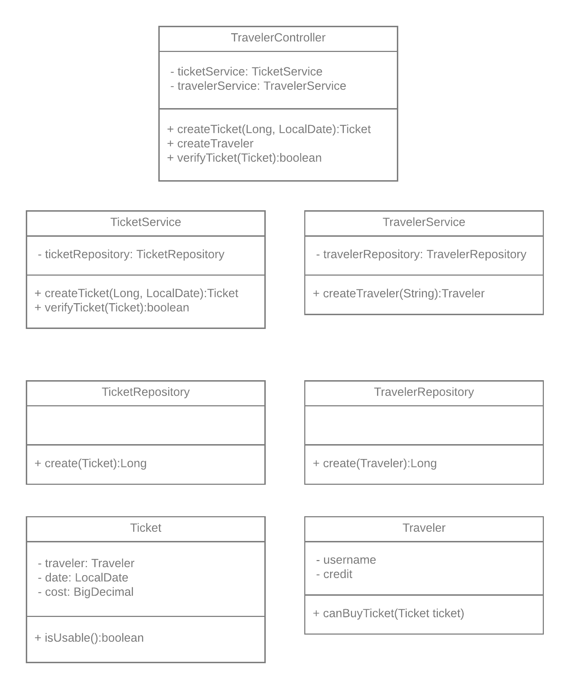

# Dutch Public Transport Payment System

## 1. High-level cloud infrastructure of the platform
To start with the cloud service, I would personally opt for AWS, as I have the most personal experience with this cloud service.

To make sure that the data used within the application and to make use of a relational database I would use Amazon's RDS.
An important problem to address is possible database failure.
If only a single database would be used, a database failure would be fatal, as this single point of failure would cause the complete system to collapse.
I would therefore opt for the Multi Availability Zone option of Amazon RDS.
This provides a standby database in a different availability zone, which can be used in case of database failure.

The main application, which would be responsible for both a company API to register new travel companies and the issuing and validating of tokens and tickets, resides in a docker container.
By making this application dockerized, we can scale the number of applications based on the current system load with Amazon ECS' Auto Scaling.
Through this scaling we make sure that travelers and companies get quick responses to their API requests.

To abstract the individual instances of the application from the API user, I would introduce a load balancer.
Apart from actually dividing the load evenly over the multiple instances of the underlying application, this load balancer could also double as a rate limiter to disallow an overflow of requests by a single IP or user.

To make sure that the individual instances can be used by the load balancer, a service registry is used on which all applications and databases register.
This service registry can then record the current available instances of the appliciation and make sure they are still healthy.
Amazon offers options for a service registry which we can use.

Lastly, when the platform is in production, it is key that an overview of the current state of the system is present.
This is particularly handy to handle errors when present or to monitor the system for usage statistics.
I would personally use the ELK stack to create this overview.
All log messages of the individual applications along with a unique identifier can then be sent to Logstash.
Through this process we can then extract usage data, possible errors, and other useful statistics, which we can then make visible through Kibana.

## 2. Connection loss case

When the system has to deal with connection loss, two separate cases can be considered: one where the token can be customized and is temporary (e.g. a one-time ticket) and one where the token is permanent and cannot be customized (e.g. a bank card with NFC).

When the token can be customized, one could customize it so that it can be verified without further communication with our application.
Lets say that we have a token which should be valid for the travel between `A` and `B` at February 14th.
The token containing user information and the travel information can then be created by the application and encrypted with a private key and returned to the user.
Assuming that the transport company has knowledge of the corresponding public key of our application, the information can then simply be decrypted and validated at the transport company side using basic logic based on the travel locations and current date and time.
Note that these tokens cannot be forged as long as the private key remains secret.

The more difficult case is when this information cannot be encoded in the token, which is the case for any token that is static, such as the identity of a bank card.
Since we want to allow passengers to still board even without a connection to our application, the best effort would be to record the unsent verifications.
After connection is restored the backlog of these verifications can then be sent to the application to ensure that no process/progress is lost.
Moreover, assuming that the connection loss is on the transport company side and therefore local to an individual bus or train, this would not cause too much harm.
To ensure that prolonged connection loss is detected, I would suggest monitoring the connection to the application every few minutes.
When this connection is lost for a long time, for example a few hours, I would then suggest stopping travelers using the vehicle as a last resort to not allow too many free rides in case of disconnect.

## 3. Java Application and API.
For a concise overview of classes used for the creation and verification of generated tickets, please look at the image below.

This small set of classes could then partially implement the REST API necessary for creating and verifying tickets.
This API is described in the swagger.yaml, which can be rendered through for example [the online swagger editor](https://editor.swagger.io/#).

## 4. Java Application Sample
In this project a Spring project can be found which provides code for creating Travelers and Tickets.
Note that this sample contains an in-memory database and its state is therefore reset each execution.
To run the server the main class of the TicketingApplication can be run.